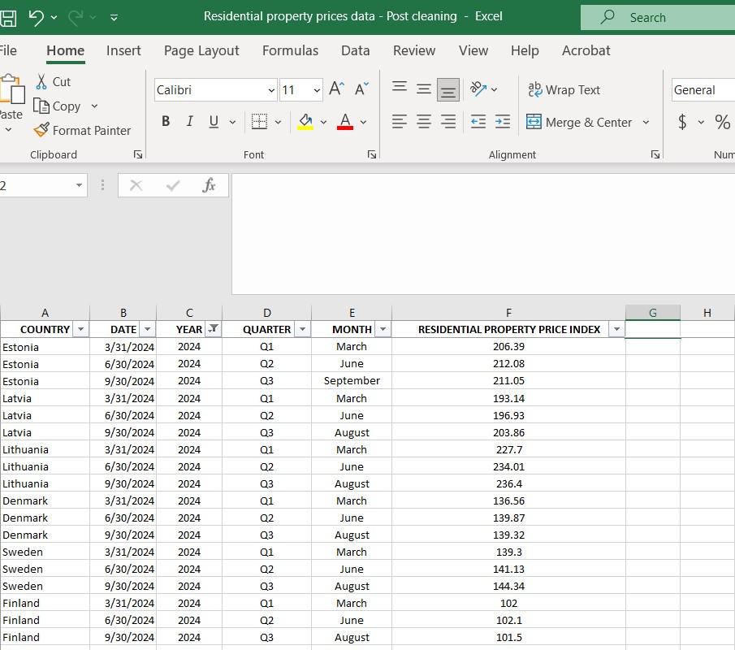
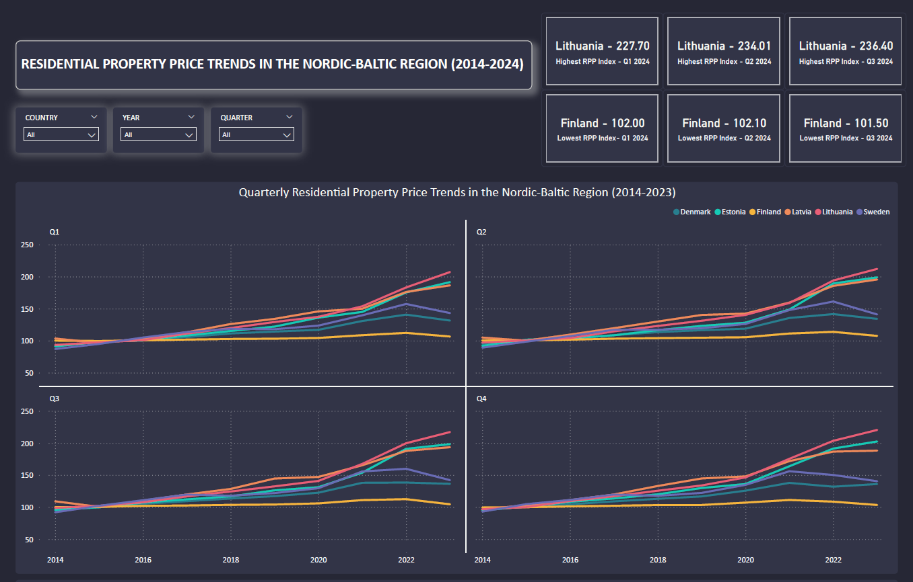
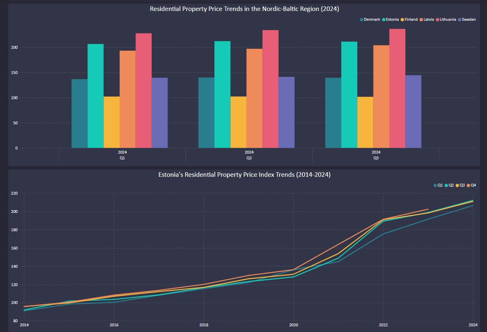
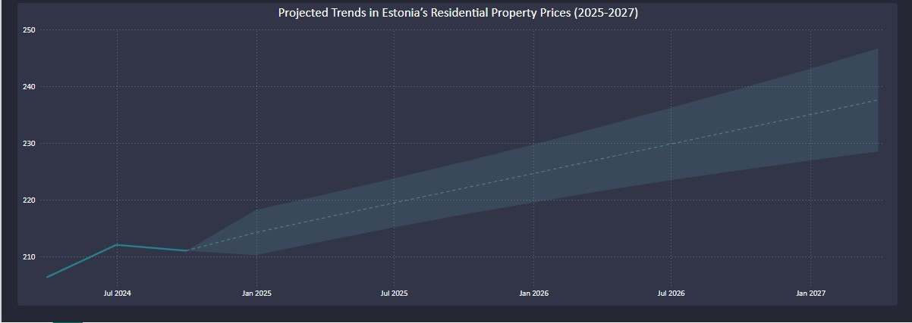

# Residential-Property-Price-Trends-in-the-Nordic-Baltic-Region-2015-to-2024

*Image: Europe modern complex of residential buildings*

*Source: [RomanBabakin](https://www.istockphoto.com/photo/europe-modern-complex-of-residential-buildings-gm1165384568-320657672)*

## 📝 PROJECT OVERVIEW
This project analyzes **residential property price** trends across some countries of the Nordic-Baltic region using the **Resdential Property Price Index (RPPI)**. The RPPI measures the percentage change in residential housing prices over time, with 2015 as the base year (2015=100). This provides a useful indicator for understanding property price changes over time. For instance, in the third quarter (Q3) of 2024, Estonia's RPPI was reported at 211.03 points, indicating a significant increase since 2015.

However, it is important to note that the index reflects overall price movements and not actual property price changes. The actual price changes can vary based on several factors, such as:
- **Geographical Location**: Prices in major cities are typically higher than in rural areas.

- **Property Type**: Apartments, detached houses, and other residential properties experience different price levels.

- **Market Dynamics**: Economic growth, supply-demand dynamics, and investment trends influence regional price differences.

Thus, while the RPPI provides valuable insights into price trends over time, it should be interpreted with an understanding that starting price levels in 2015 were not uniform, and that the index reflects relative changes rather than absolute price differences across different regions and property types.

## 📍 COUNTRIES COVERED
Denmark, Estonia, Finland, Latvia, Lithuania and Sweden.

## ⏳ TIME FRAME
2015 - 2024 (Quarterly Data)

## 📈 KEY METRICS
Residential Property Price Index (RPPI), Growth Trends, Forecasting.

## 🛠 TOOLS
Microsoft Excel (Data cleaning, preprocessing, and merging)

Power BI (Data visualization, forecasting, and dashboard creation)

## 📥 DATA SOURCES
The dataset includes quarterly residential property prices and was collected from the European Central Bank (ECB) website, which aggregates housing market information from various national statistical offices.

## ⚙️ DATA PROCESSING ANALYSIS AND VISUALIZATION
The data was sourced, downloaded, extracted, and compiled into a single Excel file. To ensure accuracy and consistency, the dataset underwent thorough cleaning and preprocessing in Excel. This process involved separating date components to facilitate time-series analysis, filtering and selecting the relevant time period to ensure that only essential data was retained, and standardizing numerical and categorical values to maintain uniformity across the dataset.

*RPPI Data (Post-Cleaning) - Excel Snapshot*

Once the cleaned dataset was ready, it was imported into Power BI for further processing and visualization. The data was formatted and optimized by ensuring that each column had the correct data type, such as dates, numbers, and categorical values. Additionally, calculated measures and columns were created to extract deeper insights and facilitate comparisons.

An interactive dashboard was designed, featuring four KPI cards and four key charts that illustrate residential property price trends across the selected Nordic-Baltic countries, allowing for a clear understanding of regional comparisons. The analysis then drills down to Estonia’s RPPI, providing future projections based on historical data trends. Additionally, four KPI cards were generated to highlight essential metrics and trends, ensuring a comprehensive and insightful analysis.

*Residential Propery Price Trends - Dashboard*

## 📊 KEY INSIGHTS (CHARTS & KPIS)
🔹 Quarterly Residential Property Price Trends in the Nordic-Baltic Region (2014-2023)

🔹 Residential Property Price Trends in the Nordic-Baltic Region (2024)

🔹 Estonia's Residential Property Price Index Trends (2014-2024)

🔹 Projected Trends in Estonia’s Residential Property Prices (2025-2027)

🔹 Top RPPI per Quarter (Highest values by country)

🔹 Lowest RPPI per Quarter (Lowest values by country)

## 🔍 KEY FINDINGS
🔹 Property prices across the Nordic-Baltic region have exhibited a consistent upward trend from 2014 to 2023. However, the rate of growth has varied, with some countries experiencing steeper price increases while others have seen more moderate growth patterns.

🔹 The Baltic countries—Estonia, Latvia, and Lithuania—have consistently recorded the highest property price index levels, including in Q1 to Q3 of 2024. This trend is possibly influenced by rising demand, economic expansion, real estate investment trends, and inflationary pressures, which may have contributed to increasing property values.

🔹 Finland has consistently maintained the lowest property price index across all years, indicating a cooling housing market or potential economic stagnation. This trend may be driven by weaker demand, reduced investment activity, and broader macroeconomic factors such as higher interest rates and restrictive economic policies that have constrained market growth.

🔹 Estonia's residential property price index continued its upward trajectory in 2024, with the price index reaching 206.39 in Q1, peaking at 212.08 in Q2, and seeing a slight decline to 211.05 in Q3. Several factors influenced price movements, including:
- Economic Conditions: High inflation and interest rates reduced affordability, leading to lower transaction volumes despite the overall price increase.
- Supply and Demand: A decline in new housing construction limited supply, keeping prices elevated, especially in urban areas like Tallinn.
- Investor Sentiment: Caution among investors due to geopolitical uncertainties and policy changes resulted in slower price increases compared to previous years.
- Taxation Effects: An anticipated tax hike in late 2023 led to a surge in transactions before 2024, followed by market cooling in subsequent months.

🔹 Estonia's residential property prices are projected to rise from 2025 to 2027, signaling potential market growth but also raising affordability concerns for buyers and renters.

## 📂 ADDITIONAL RESOURCES

- [RPPI Data - Pre-Cleaning (Excel)](https://github.com/AnalyticsByKristin/Residential-Property-Price-Trends-in-the-Nordic-Baltic-Region-2015-to-2024/raw/refs/heads/main/RPPI%20Data%20-%20Pre-Cleaning.xlsx) 
- [ RPPI Data - Post-Cleaning (Excel)](https://github.com/AnalyticsByKristin/Residential-Property-Price-Trends-in-the-Nordic-Baltic-Region-2015-to-2024/raw/refs/heads/main/RPPI%20Data%20-%20Post-Cleaning.xlsx)  
- [Residential Property Pricing Index Dashboard (Power BI)](https://github.com/AnalyticsByKristin/Residential-Property-Price-Trends-in-the-Nordic-Baltic-Region-2015-to-2024/raw/refs/heads/main/Residential%20Property%20Pricing%20Index%20(2015%20-%202024)%20-%20PowerBI.pbix)  
- [Residential Property Prices Report (PDF)](https://github.com/AnalyticsByKristin/Residential-Property-Price-Trends-in-the-Nordic-Baltic-Region-2015-to-2024/blob/bf142a1eb01c6c790362cc8ec285fbf1fcd4e07e/Residential%20property%20prices%20-%20Dashboard%20-%20PDF.pdf)  

## 🔗 REFERENCES
| Country   | Data Source |
|-----------|------------|
| Denmark   | [Residential property prices, Denmark, Quarterly](https://data.ecb.europa.eu/data/datasets/RESR/RESR.Q.DK._T.N.RTH.TVAL.DK1.TB.N.IX) |
| Estonia   | [Residential property prices, Estonia, Quarterly](https://data.ecb.europa.eu/data/datasets/RESR/RESR.Q.EE._T.N._TR.TVAL.EE1.TB.N.IX) |
| Finland   | [Residential property prices, Finland, Quarterly](https://data.ecb.europa.eu/data/datasets/RESR/RESR.Q.FI._T.N.XTR.TVAL.FI1.TB.N.IX) |
| Latvia    | [Residential property prices, Latvia, Quarterly](https://data.ecb.europa.eu/data/datasets/RESR/RESR.Q.LV._T.N._TR.TVAL.LV1.TB.N.IX) |
| Lithuania | [Residential property prices, Lithuania, Quarterly](https://data.ecb.europa.eu/data/datasets/RESR/RESR.Q.LT._T.N._TR.TVAL.4D0.TB.N.IX) |
| Sweden    | [Residential property prices, Sweden, Quarterly](https://data.ecb.europa.eu/data/datasets/RESR/RESR.Q.SE._T.N.XTR.TVAL.SE1.TB.N.IX) |